# Scenario
> On 09/20/04 , a Dell CPi notebook computer, serial # VLQLW, was found abandoned along with a wireless PCMCIA card and an external homemade 802.11b antennae. It is suspected that this computer was used for hacking purposes, although cannot be tied to a hacking suspect, G=r=e=g S=c=h=a=r=d=t. (The equal signs are just to prevent web crawlers from indexing this name; there are no equal signs in the image files.)  Schardt also goes by the online nickname of "Mr. Evil" and some of his associates have said that he would park his vehicle within range of Wireless Access Points (like Starbucks and other T-Mobile Hotspots) where he would then intercept internet traffic, attempting to get credit card numbers, usernames & passwords.
>
>Find any hacking software, evidence of their use, and any data that might have been generated. Attempt to tie the computer to the suspect, G=r=e=g S=c=h=a=r=d=t.

## 1. What is the image hash? Does the acquisition and verification hash match?
> aee4fcd9301c03b3b054623ca261959a. No acquisition hash given.
>
> Method: Click on Data Sources -> Image

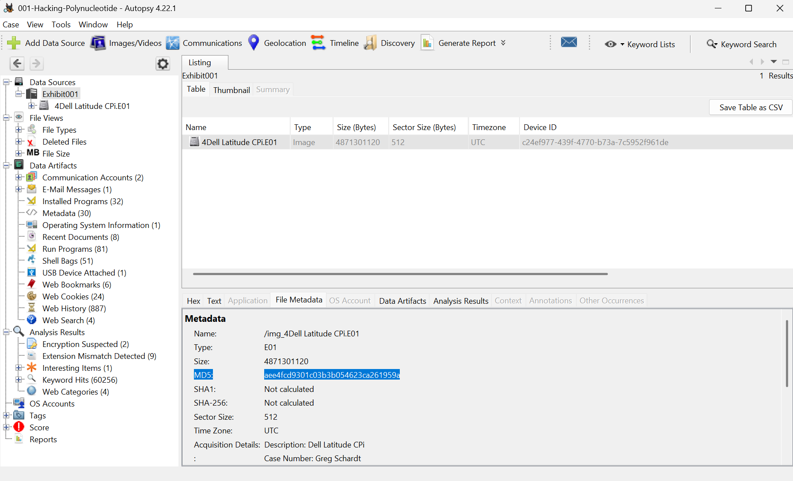

## 2. What operating system was used on the computer?
> Microsoft Windows XP
>
> Method: Click on Data Sources -> Image

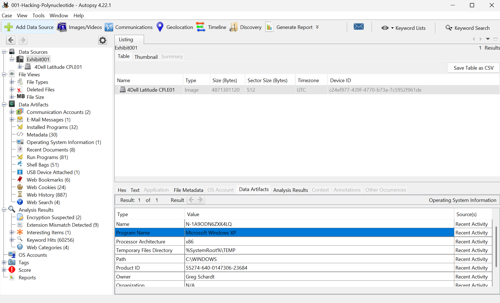

## 3. When was the install date?
> Thursday, August 19, 2004 16:48:27, UTC-06:00 
>
> Method: 
> 1. Go to "C:/WINDOWS/system32/config/software/Microsoft/Windows NT/CurrentVersion/InstallDate".
> 2. Convert 1092955707 Unix time to human readable datetime.

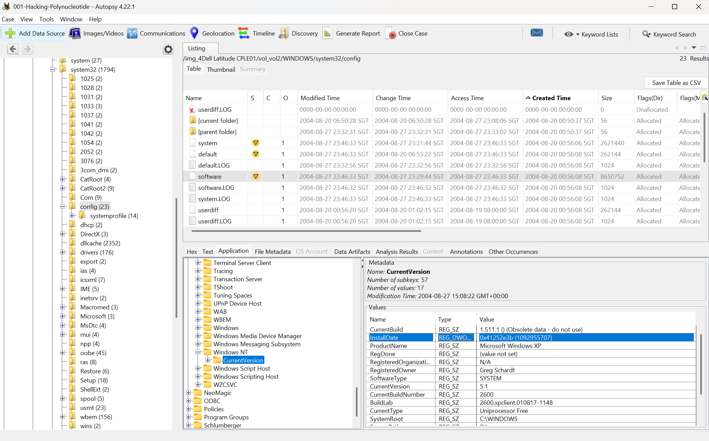

## 4. What is the timezone settings?
> Central Standard Time UTC-06:00
>
> Method: Go to "C:/WINDOWS/system32/config/system/ControlSet001/Control/TimeZoneInformation".

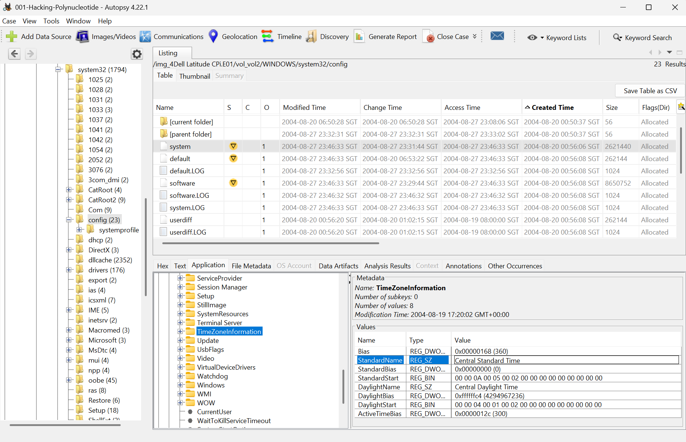

## 5. Who is the registered owner?
> Greg Schardt
>
> Method: Go to "C:/WINDOWS/system32/config/software/Microsoft/Windows NT/CurrentVersion".

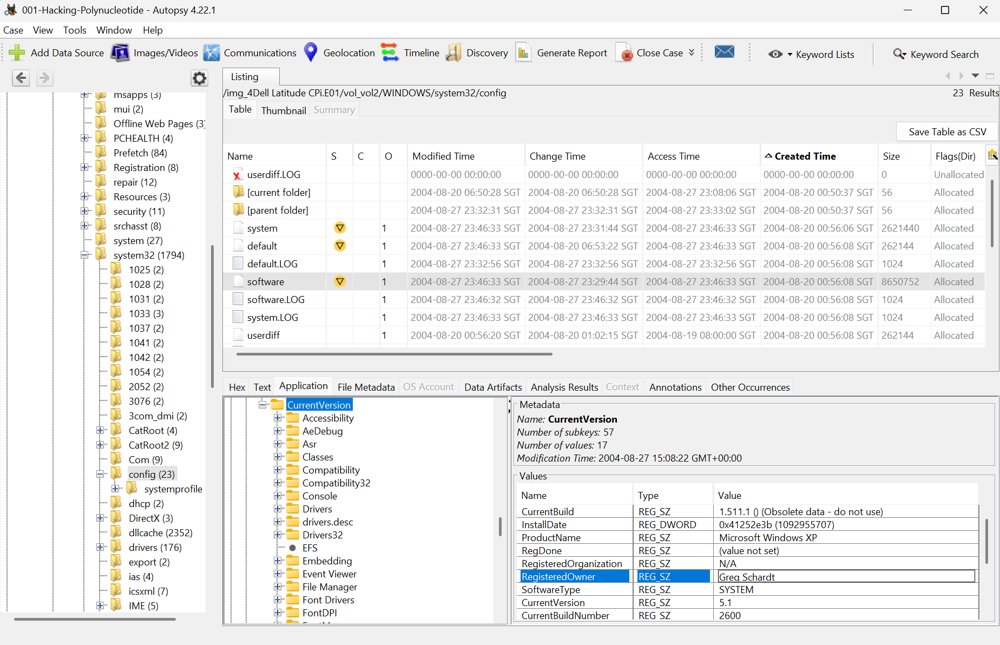

## 6. What is the computer account name?
> Mr. Evil
>
> Method: Go to "C:/WINDOWS/system32/config/software/Microsoft/Windows NT/CurrentVersion/Winlogon".

## 7. What is the primary domain name?
> N-1A9ODN6ZXK4LQ
>
> Method: Go to "C:/WINDOWS/system32/config/software/Microsoft/Windows NT/CurrentVersion/Winlogon".

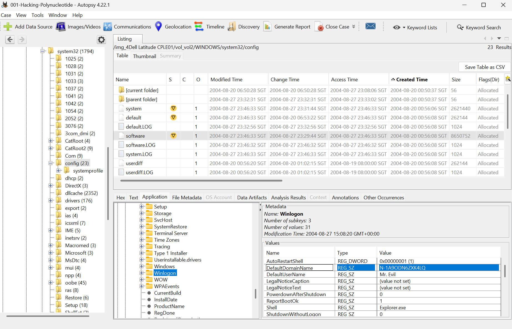

## 8. When was the last recorded computer shutdown date/time?
> Friday, August 27, 2004 09:46:33, UTC-06:00
>
> Method:
> 1. Go to "C:/WINDOWS/system32/config/system/ControlSet001/Control/Windows".
> 2. Convert bytes to human readable datetime using DCode.

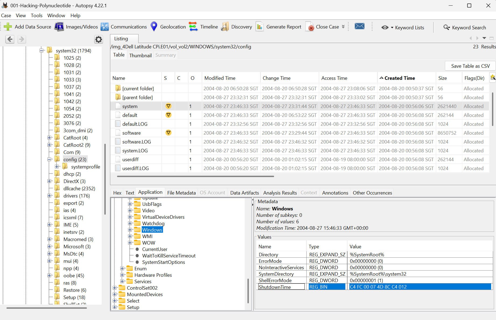
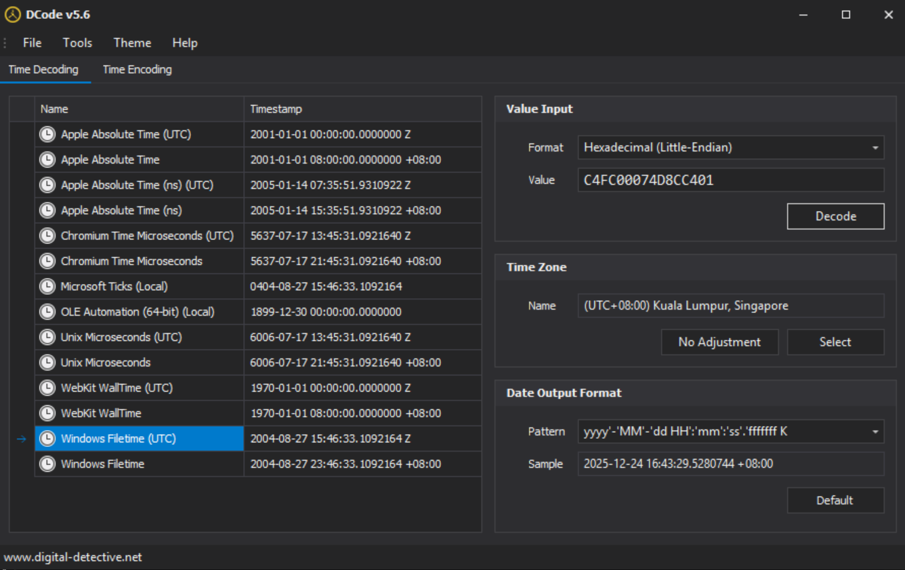

## 9. How many accounts are recorded (total number)?
> 5
>
> Method: Click on OS Accounts

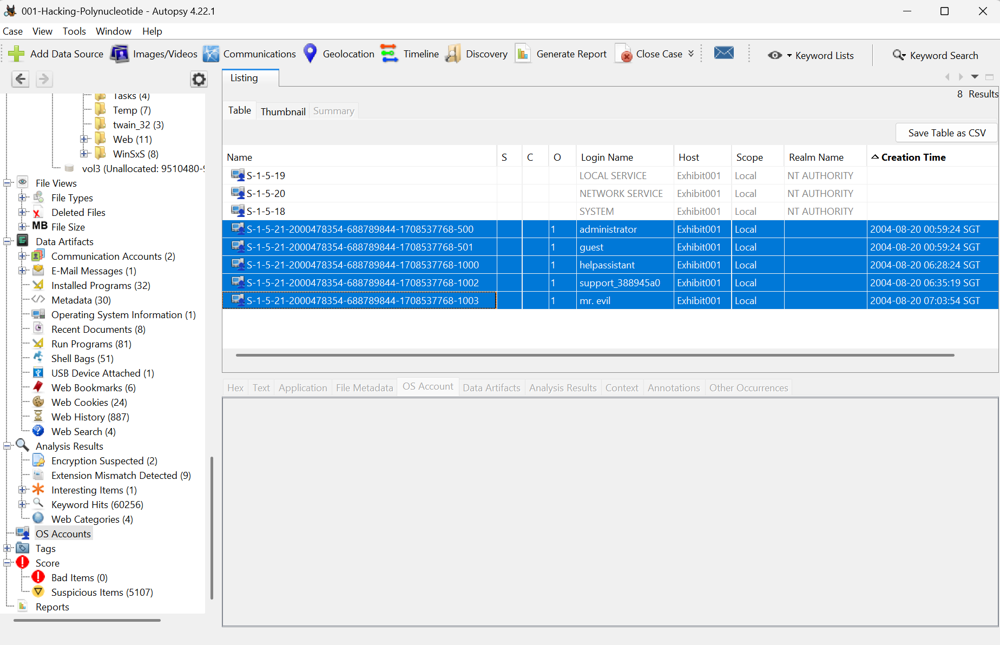

## 10. What is the account name of the user who mostly uses the computer?
> Mr. Evil
>
> Method: Click on OS Accounts -> mr. evil (15 Login Counts)

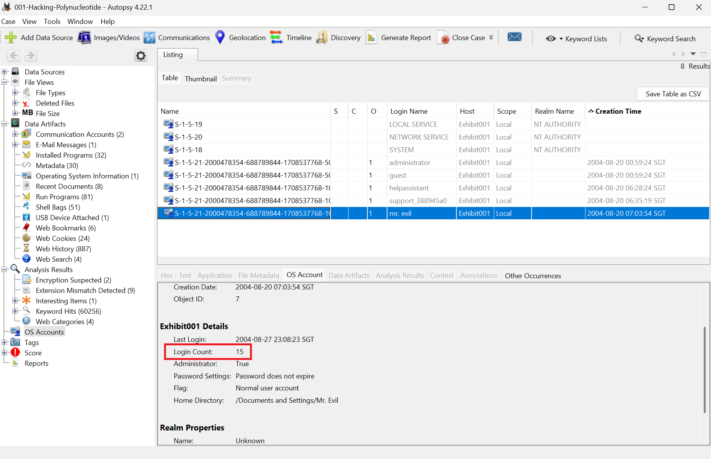

## 11. Who was the last user to logon to the computer?
> Mr. Evil. Winlogon stores the most recent user that logged in.
>
> Method: Go to "C:/WINDOWS/system32/config/software/Microsoft/Windows NT/CurrentVersion/Winlogon".

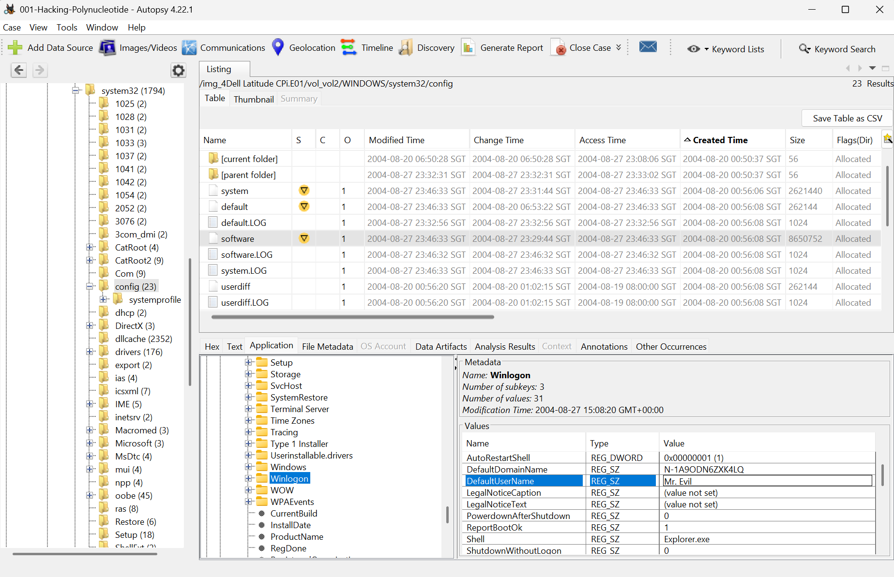

## 12. A search for the name of “G=r=e=g S=c=h=a=r=d=t” reveals multiple hits. One of these proves that G=r=e=g S=c=h=a=r=d=t is Mr. Evil and is also the administrator of this computer. What file is it? What software program does this file relate to?
> The file is "irunin.ini" and the software program is "Look@LAN".
>
> Method:
> 1. Search "Greg Schardt" in Keyword Search.
> 2. In "irunin.ini", we can see that:
>     - LANUSER: Mr. Evil.
>     - REGOWNER: Greg Schardt
>     - ISUSERNTADMIN: True
>     - The configuration is for the Look@LAN program.

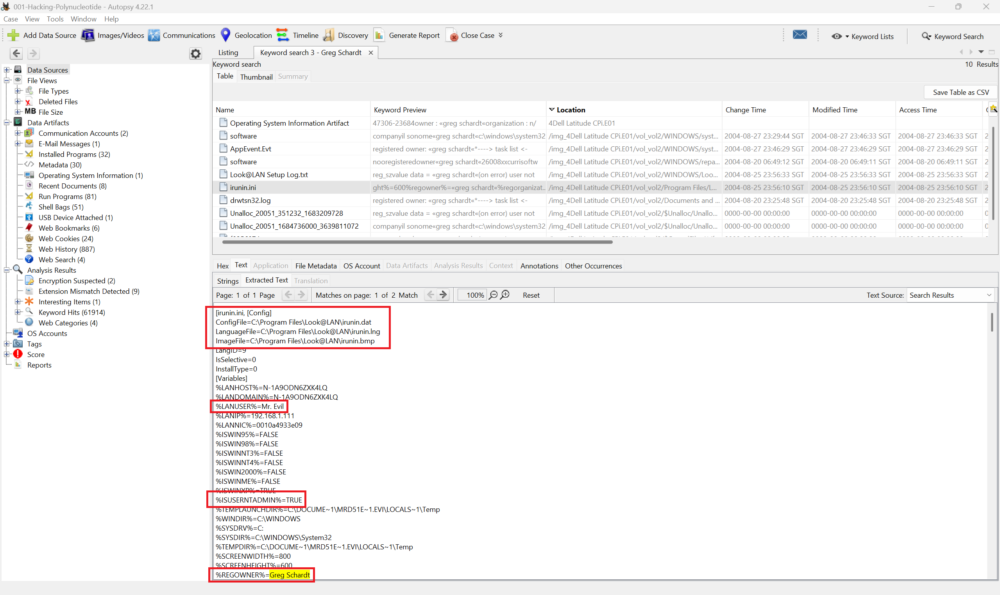

## 13.  List the network cards used by this computer
> Compaq WL110 Wireless LAN PC Card 
> Xircom CardBus Ethernet 100 + Modem 56 (Ethernet Interface)
>
> Method: Go to "C:/WINDOWS/system32/config/software/Microsoft/Windows NT/CurrentVersion/NetworkCards".

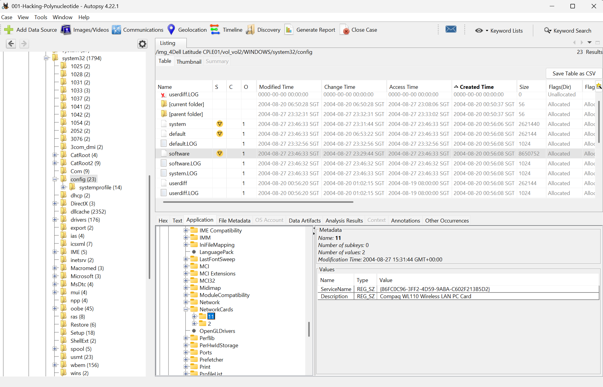

## 14. This same file reports the IP address and MAC address of the computer. What are they?
> 192.168.1.111 
> 0010a4933e09
>
> Method: In "irunin.ini", the IP address is 192.168.1.111 and the MAC address is 0010a4933e09.

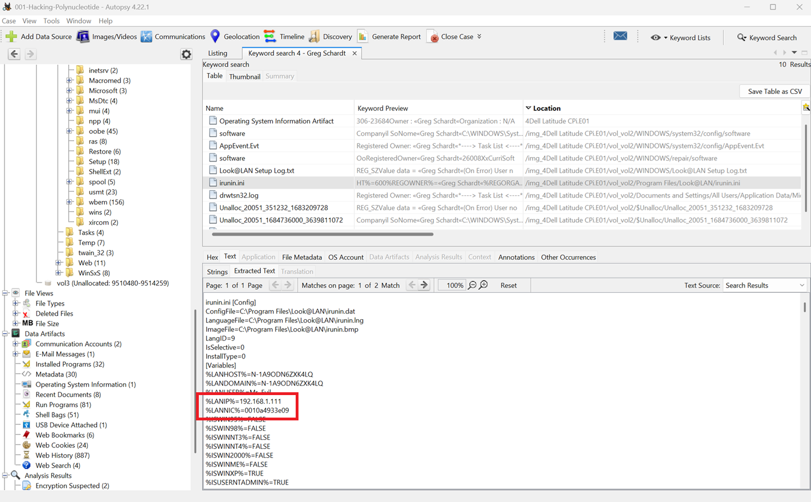

## 15. An internet search for vendor name/model of NIC cards by MAC address can be used to find out which network interface was used. In the above answer, the first 3 hex characters of the MAC address report the vendor of the card. Which NIC card was used during the installation and set-up for LOOK@LAN?
> Xircom

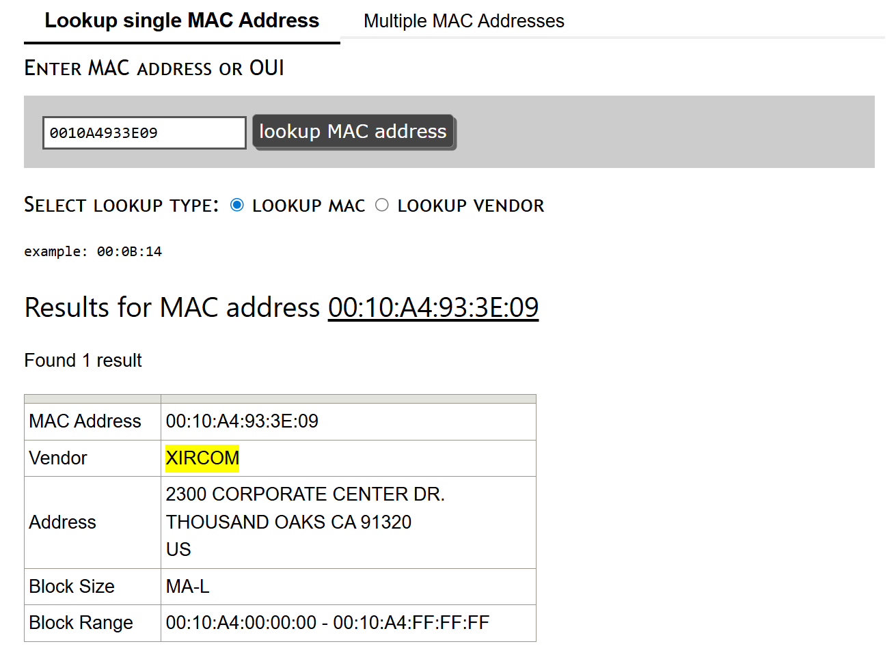

## 16. Find 6 installed programs that may be used for hacking.
> Installed Programs
> 1. Ethereal 0.10.6 v.0.10.6 (Packet Sniffer)
> 2. WinPcap 3.01 alpha (Packet Sniffer)
> 3. 123 Write All Stored Passwords (Storing Passwords)
> 4. Network Stumbler 0.4.0 (Wireless LAN Detection)
> 5. Cain & Abel v2.5 beta45 (Password Recovery Tool)
> 6. Anonymizer Bar 2.0 (Browse Web Anonymously)
>
> Method: Click on Data Artifacts -> Installed Programs (32)

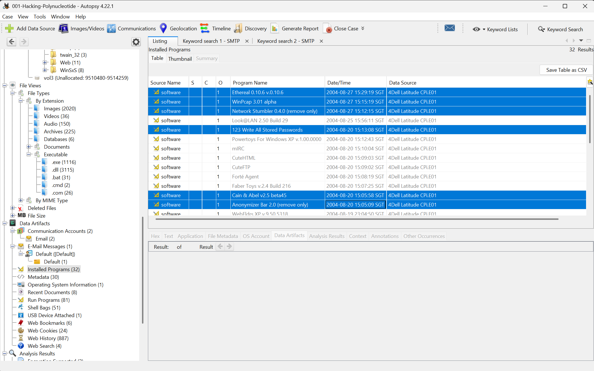

## 17. What is the SMTP email address for Mr. Evil?
> whoknowsme@sbcglobal.net
>
> Method:
> 1. Search "SMTP" in Keyword Search.
> 2. Click on the "NTUSER.DAT" file. We can see "whoknowsme@sbcglobal.net" is the SMTP email address.

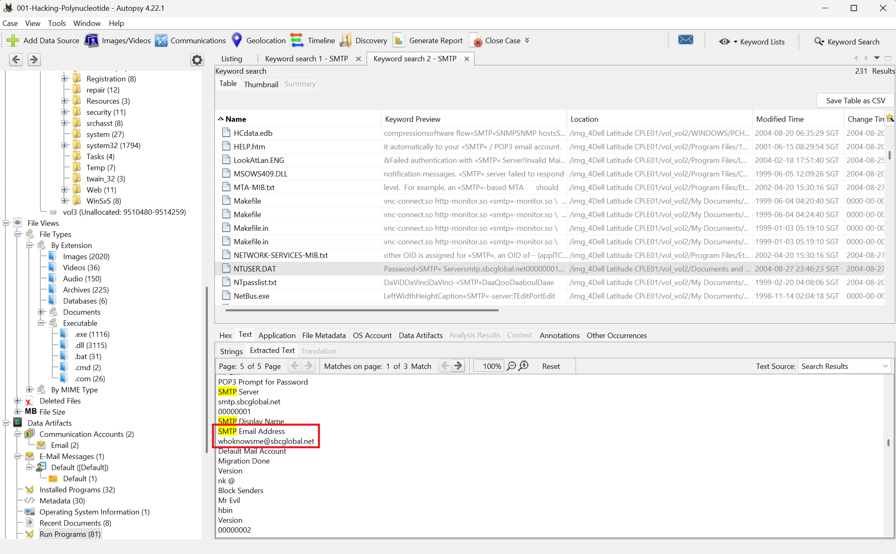

## 18. What are the NNTP (news server) settings for Mr. Evil?
> NNTP Server: news.dallas.sbcglobal.net 
> NNTP Password: news.dallas.sbcglobal.netF6E2BA30
>
> Method:
> 1. Search "NNTP" in Keyword Search.
> 2. Click on the "NTUSER.DAT" file.

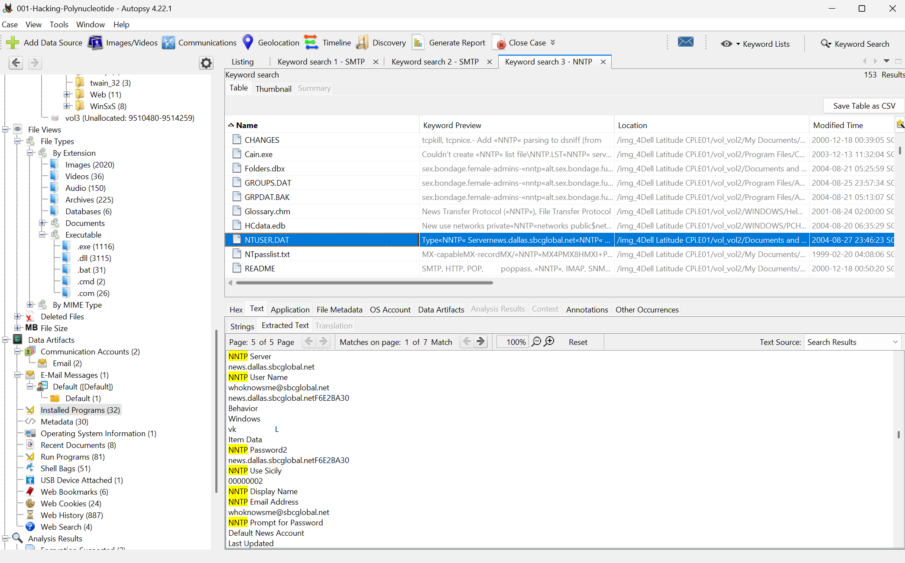

## 19. What two installed programs show this information?
> Installed Programs
> 1. Microsoft Outlook Express
> 2. Forte Agent
>
> Method:
> 1. Search "news.dallas.sbcglobal.net" in Keyword Search.
> 2. Expand the "Location" column. We can see which programs they come from. The first installed program is Microsoft Outlook Express.
> 3. Visit the directory of the "AGENT.INI" file, C:/Program Files/Agent.
> 4. Click on "readme.txt". We can see that the second installed program is Forte Agent.

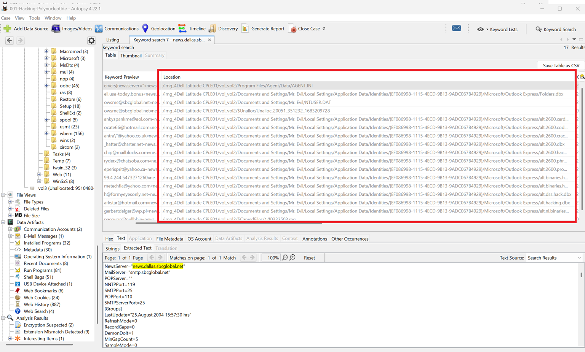
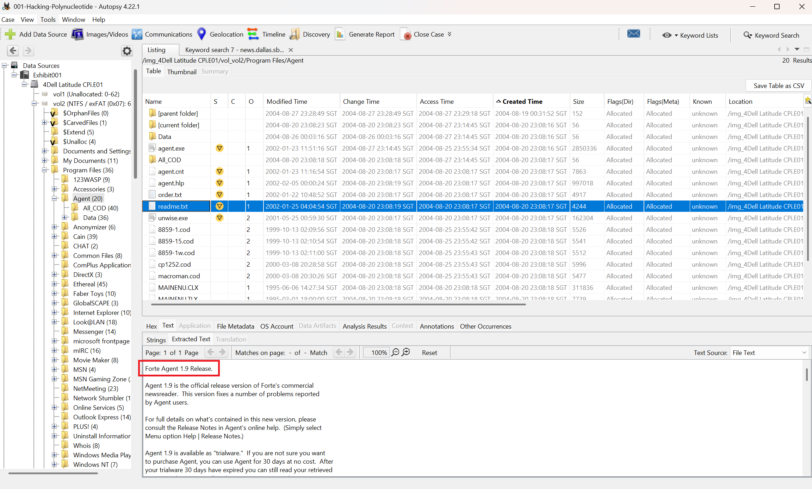

## 20. List 5 newsgroups that Mr. Evil has subscribed to?
> Subscribed Newsgroups
> 1. alt.2600.hackerz
> 2. alt.binaries.hacking.beginner
> 3. alt.binaries.hacking.computers
> 4. alt.dss.hack
> 5. alt.hacking
>
> Method:
> 1. Search "news.dallas.sbcglobal.net" in Keyword Search.
> 2. The ".dbx" files with location "C:/Document and Settings/Mr. Evil/Local Settings/Application Data/Identities/{EF086998–1115–4ECD-9B13-9ADC067B4929}/Microsoft/Outlook Express".

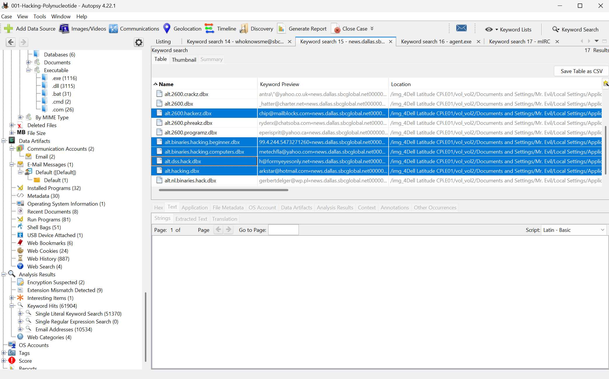

## 21. A popular IRC (Internet Relay Chat) program called MIRC was installed. What are the user settings that was shown when the user was online and in a chat channel?
> mIRC User Settings
> * user: Mini Me
> * email: none@of.ya
> * anick: mrevilrulez
>
> Method: Go to the file at "C:/Program Files/mIRC/mirc.ini".

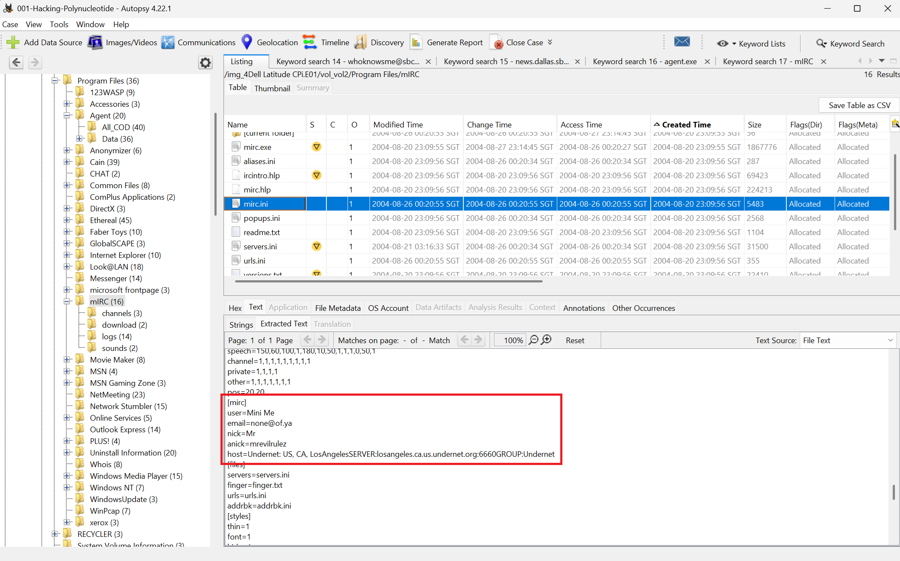

## 22. This IRC program has the capability to log chat sessions. List 3 IRC channels that the user of this computer accessed.
> 3 IRC channels
> * Elite.Hackers.UnderNet
> * Chataholics.UnderNet
> * CyberCafe.UnderNet
>
> Method: Go to "C:/Program Files/mIRC/logs". The ".log" files are the channels accessed.

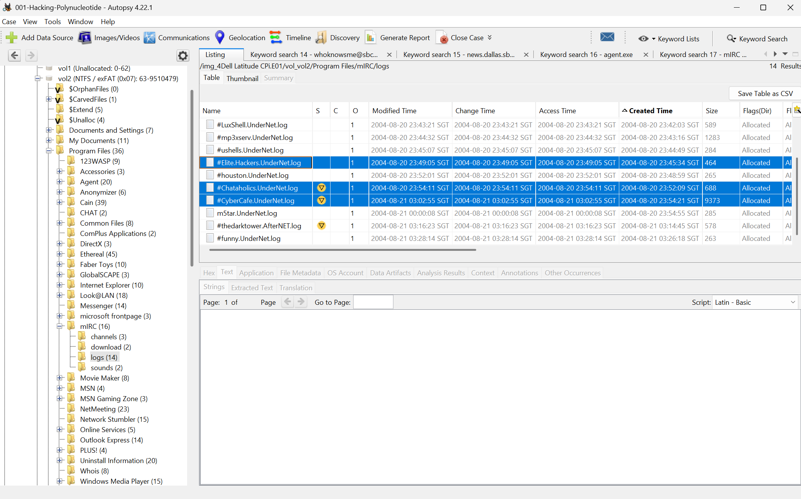
